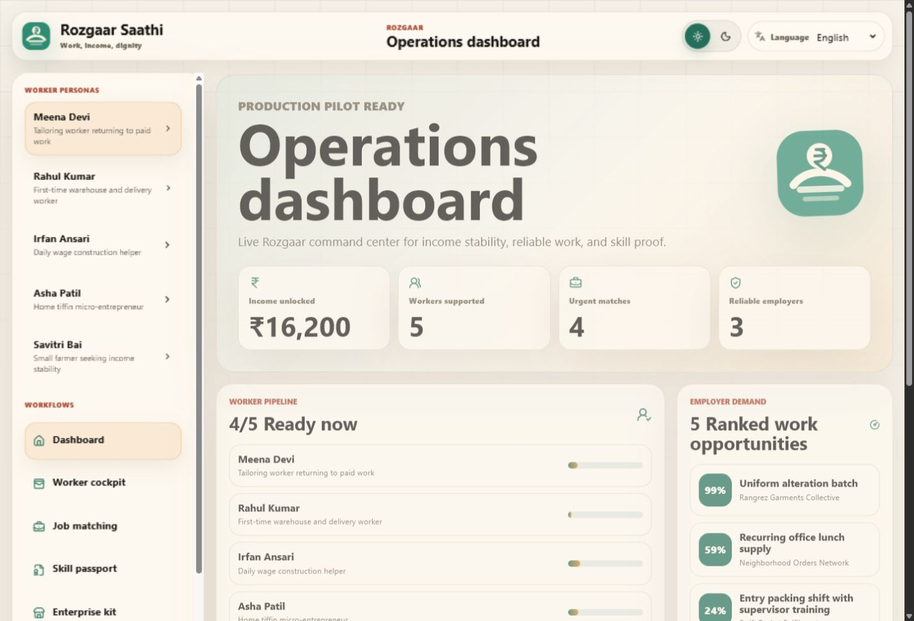
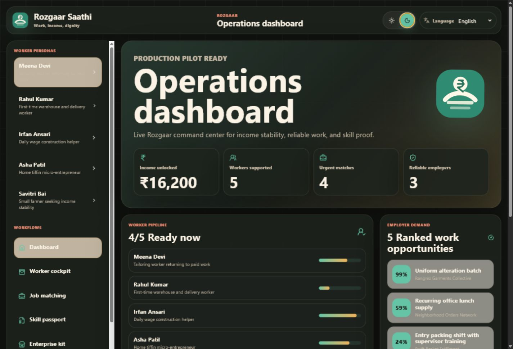
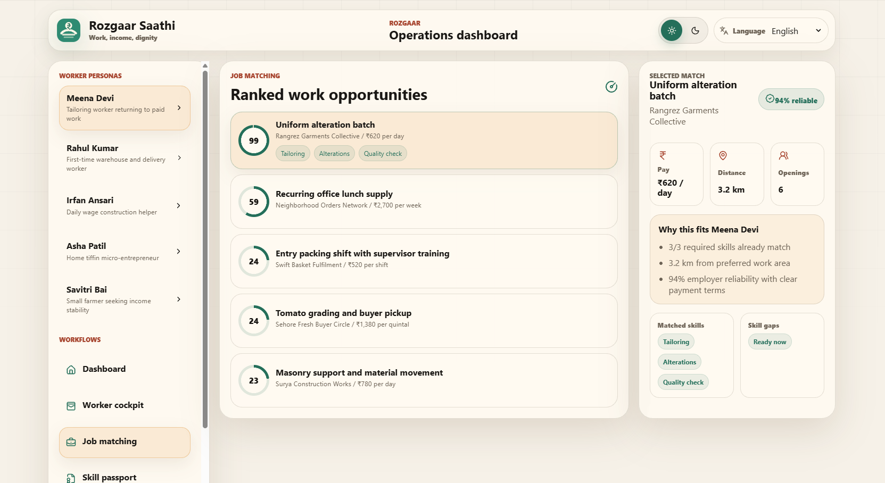
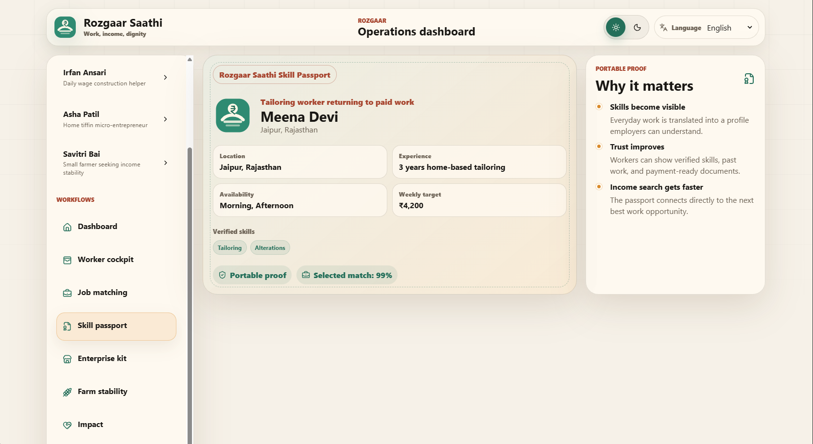
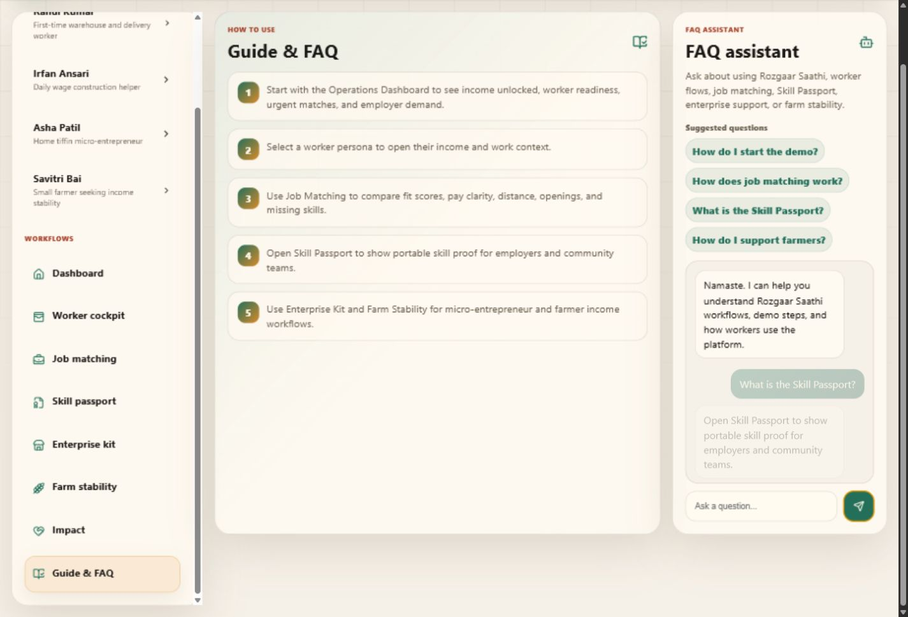
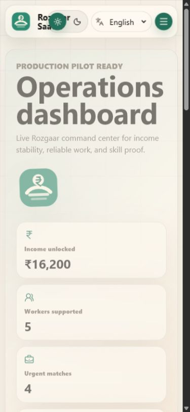
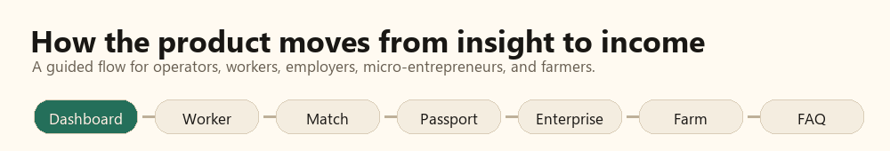
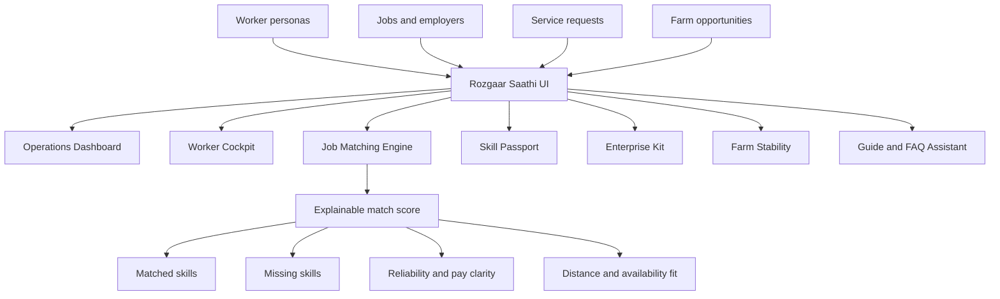

<div align="center">
  

  <h1>Rozgaar Saathi</h1>

  <p>
    A dashboard-first Rozgaar platform for informal worker income planning,
    skill-job matching, Skill Passports, micro-enterprise support, and farmer income stability.
  </p>

  <p>
    <a href="https://github.com/AnuranjanJain/samasocial_buildforgood"><strong>Repository</strong></a>
    ·
    <a href="#how-it-works"><strong>How it works</strong></a>
    ·
    <a href="#screenshots"><strong>Screenshots</strong></a>
    ·
    <a href="#run-locally"><strong>Run locally</strong></a>
  </p>

  <p>
    
    
    
    
  </p>
</div>


## The Idea

India's informal workers often have skills, trust, and willingness to work, but not the tools that formal workers take for granted: visible skill proof, reliable job discovery, income planning, and a way to compare opportunities before accepting work.

**Rozgaar Saathi** turns that gap into an operating system for work access.

It helps community teams, NGOs, and placement operators support five Rozgaar needs in one product:

- Daily wage worker income tools
- Skill-job matching for first-time workers
- Women's economic participation
- Micro-entrepreneur support
- Farmer income stability

## What The Product Does

Rozgaar Saathi opens directly into an **Operations Dashboard**. From there, an operator can understand who needs work, what income gap remains, which employers are reliable, and where the next best opportunity is.

| Workflow | What it solves |
| --- | --- |
| **Operations Dashboard** | Tracks worker pipeline, income unlocked, urgent matches, employer demand, and language coverage. |
| **Worker Cockpit** | Shows weekly income target, secured earnings, pending payments, completed shifts, and next best work. |
| **Job Matching** | Ranks jobs by skills, distance, segment fit, reliability, pay clarity, and worker preferences. |
| **Skill Passport** | Creates portable proof of skills, documents, availability, work readiness, and best match score. |
| **Enterprise Kit** | Helps micro-entrepreneurs package services, price ranges, repeat customers, and local earning leads. |
| **Farm Stability** | Shows buyer opportunities, seasonal produce windows, and off-season income suggestions. |
| **Guide & FAQ** | Adds in-product onboarding and a local FAQ assistant for demo and usage questions. |

## Screenshots

| Operations Dashboard | Dark Mode |
| --- | --- |
|  |  |

| Job Matching | Skill Passport |
| --- | --- |
|  |  |

| FAQ Assistant | Mobile Dashboard |
| --- | --- |
|  |  |

## How It Works

Rozgaar Saathi is currently a polished frontend pilot with typed local data and deterministic product logic. It is intentionally lightweight for the Build for Good idea submission stage, but structured so a backend can be added without rewriting the product surface.





### Matching Logic

The job matching flow scores opportunities using:

- Skill overlap between worker profile and job requirements
- Worker segment fit, such as first-time worker, daily wage worker, farmer, or micro-entrepreneur
- Distance against the worker's preferred travel range
- Employer reliability and payment clarity
- Women-friendly work indicators when Women's Work Mode is active

The result is not just a number. Each match explains **why** the opportunity fits and which skill gaps remain.

### Skill Passport

The Skill Passport gives workers a shareable identity for work readiness:

- Name, location, role, and experience
- Verified skills
- Availability
- Weekly income target
- Document readiness
- Best current job match

For workers without resumes, this becomes a practical proof-of-work card.

### FAQ Assistant

The FAQ assistant is local and privacy-safe. It does not send data to an external model. It answers common questions about:

- Starting the demo
- Worker personas
- Job matching
- Skill Passport
- Enterprise and farmer workflows
- Language and theme settings

## Design Principles

- **Dashboard first:** the first screen is useful immediately.
- **Worker dignity:** the product treats informal work as skilled work.
- **Explainability:** match scores show reasons, not black-box results.
- **Regional access:** English, Hindi, Tamil, Telugu, Bengali, Marathi, Kannada, and Malayalam are supported.
- **Accessible polish:** light/dark mode, responsive layouts, keyboard-friendly controls, and reduced-motion support.
- **No backend dependency:** the product is demo-ready and deployable as a static Vite app.

## Tech Stack

| Layer | Choice |
| --- | --- |
| Frontend | React 19 + TypeScript |
| Build tool | Vite |
| Icons | Lucide React |
| Styling | Custom CSS design system |
| State | Local React state |
| Data | Typed local dataset |
| Deployment | Vercel-ready static build |

## Project Structure

```text
src/
  App.tsx       Product flows, matching logic, FAQ assistant, dashboard state
  App.css       Design system, responsive layout, light/dark themes, animations
  brand.tsx     Logo mark and wordmark components
  data.ts       Demo workers, jobs, employers, service requests, farm opportunities
  i18n.ts       8-language UI translation dictionary
  types.ts      Shared TypeScript models

docs/assets/
  *.png         README screenshots
  *.gif         Animated product tour, running text banner, workflow runner
```

## Run Locally

```bash
npm install
npm run dev
```

Build for production:

```bash
npm run build
```

Preview the production build:

```bash
npm run preview
```

## Build For Good Submission

| Field | Value |
| --- | --- |
| Project title | Rozgaar Saathi |
| Theme | ROZGAAR |
| Demo URL | Add Vercel link after deployment |
| Repo URL | https://github.com/AnuranjanJain/samasocial_buildforgood |
| Video URL | Add after recording |
| Presentation URL | Add after deck is published |

### Short Description

Rozgaar Saathi helps India's informal workers improve income dignity through skill-job matching, weekly income planning, Skill Passports, micro-enterprise support, and farmer income stability workflows.

## Roadmap

- Worker and employer authentication
- Real location-aware job discovery
- Worker-owned verification and references
- WhatsApp/SMS sharing for Skill Passport
- Farmer buyer integrations
- Micro-enterprise order tracking and payments
- NGO and government partner reporting views
- Backend API for live jobs, worker profiles, and field-worker operations

## License

Built for Build for Good by SamaSocial. License can be added before public production use.
